# Homework 1

## Set-up

To deploy HDFS cluster, run:
```
  docker-compose up
```

## Блок 1. Развертывание локального кластера Hadoop

1) Развернуть локальный кластер в конфигурации 1 NN, 3 DN + NM, 1 RM, 1 History server (инструкция)
2) Изучить настройки и состояние NM и RM в веб-интерфейсе
3) Сделать скриншоты NN и RM, добавить в репозиторий


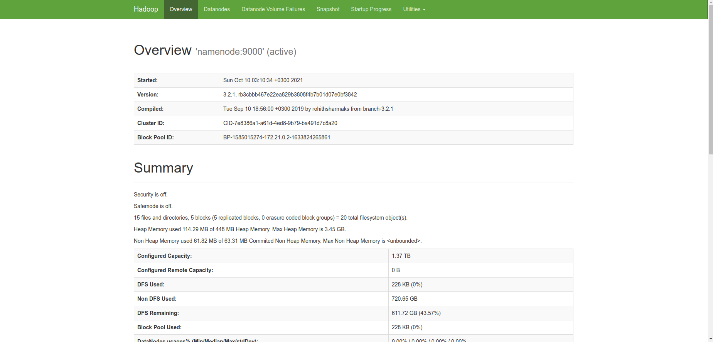
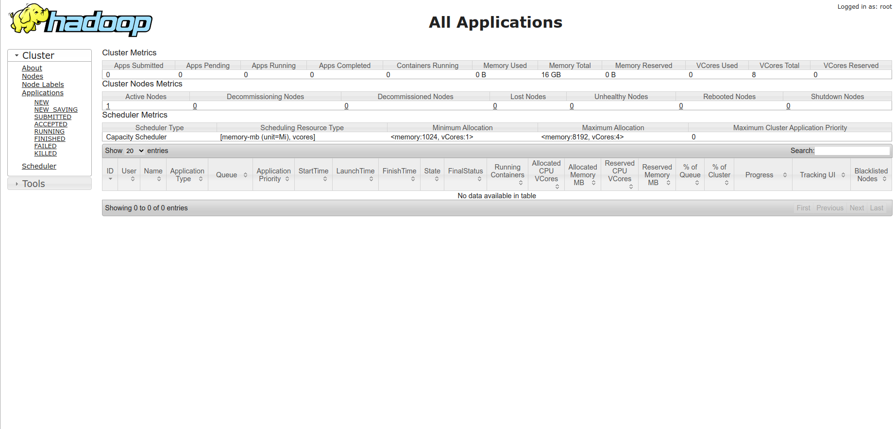

## Блок 2. Работа с HDFS

1) Выполните задания, записав выполненные команды последовательно в текстовый файл
2) Добавьте файл в репозиторий (./script.sh)

1.1 [2 балла] Создайте папку в корневой HDFS-папке 
```
hdfs dfs -mkdir /newfolder
```
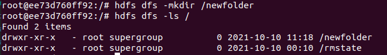

1.2 [2 балла] Создайте в созданной папке новую вложенную папку.
```
hdfs dfs -mkdir /newfolder/subfolder
```
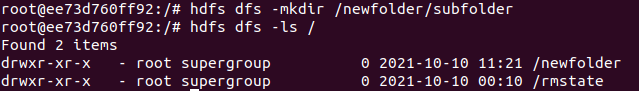

1.3 [3 балла] Что такое Trash в распределенной FS? Как сделать так, чтобы файлы удалялись сразу, минуя “Trash”?
```
Trash - корзина удаленых файлов. Нужна чтобы восстановить случайно удаленные файлы
Чтобы миновать это нужно использовать параметр -skipTrash
```

1.4 [2 балла] Создайте пустой файл в подпапке из пункта 2.
```
hdfs dfs -touchz /newfolder/subfolder/newfile.txt
```
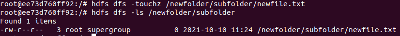

1.5 [2 балла] Удалите созданный файл.
```
hdfs dfs -rm -skipTrash /newfolder/subfolder/newfile.txt
```
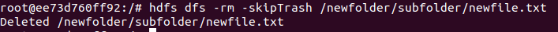

1.6 [2 балла] Удалите созданные папки.
```
hdfs dfs -rm -skipTrash -r /newfolder
```
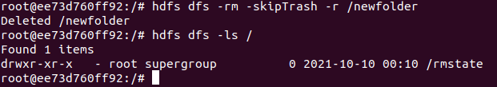

2.1 [3 балла] Скопируйте любой файл в новую папку на HDFS
```
sudo docker cp deutschland.txt namenode:/
hdfs dfs -put deutschland.txt /
```
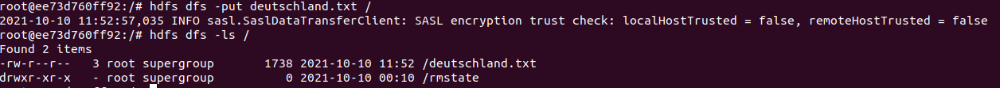

2.2 [3 балла] Выведите содержимое HDFS-файла на экран.
```
hdfs dfs -cat /deutschland.txt
```
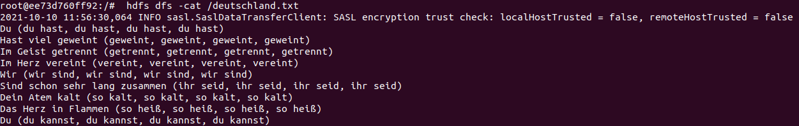

2.3 [3 балла] Выведите содержимое нескольких последних строчек HDFS-файла на экран.
```
hdfs dfs -cat /deutschland.txt | tail 
```
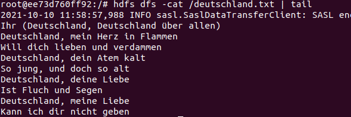

2.4 [3 балла] Выведите содержимое нескольких первых строчек HDFS-файла на экран.
```
hdfs dfs -cat /deutschland.txt | head -n 2 
```
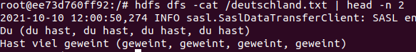

2.5 [3 балла] Переместите копию файла в HDFS на новую локацию.
```
hdfs dfs -cp /deutschland.txt /newfolder/deutchland.txt
```
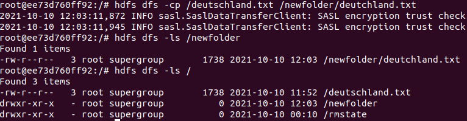

3.1 [3 балла] Изменить replication factor для файла. Как долго занимает время на увеличение /
уменьшение числа реплик для файла?
```
hdfs dfs -setrep -w 1 /deutschland.txt # Заняло секунд 14
hdfs dfs -setrep -w 3 /deutschland.txt # Заняло секунд 8
```
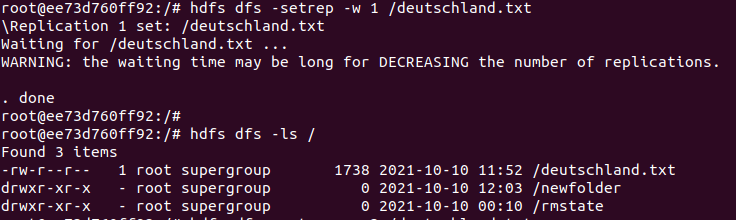
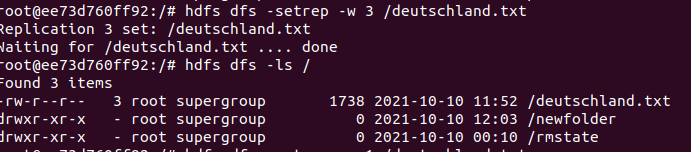

3.2 [3 балла]  [4 баллов] Найдите информацию по файлу, блокам и их расположениям с помощью “hdfs fsck”
```
hdfs fsck /deutschland.txt -files -blocks -locations
```
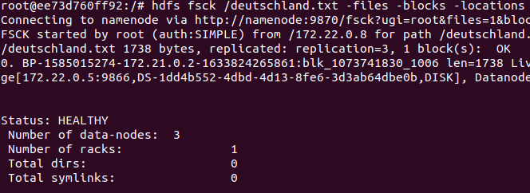


3.3 [3 балла]  [4 баллов] Получите информацию по любому блоку из п.2 с помощью "hdfs fsck -blockId”.
Обратите внимание на Generation Stamp (GS number).
```
hdfs fsck -blockId blk_1073741830
```
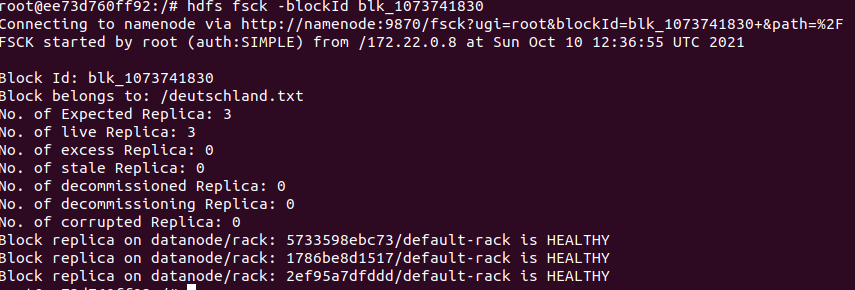

## Блок 3. Написание map reduce на Python 

1. Загрузите датасет по ценам на жилье Airbnb, доступный на kaggle.com:
https://www.kaggle.com/dgomonov/new-york-city-airbnb-open-data  (./data/ab_nyc.csv)
2. Подсчитайте среднее значение и дисперсию по признаку ”price” стандартными способами (”чистый код” или
использование библиотек). Не учитывайте пропущенные значения при подсчете статистик.
3. Используя Python, реализуйте скрипт mapper.py и reducer.py для расчета каждой из двух величин. В итоге у вас
должно получиться 4 скрипта: 2 mapper и 2 reducer для каждой величины.
4. Проверьте правильность подсчета статистик методом map-reduce в сравнении со стандартным подходом
5. Результаты сравнения (то есть, подсчета двумя разными способами) для среднего значения и дисперсии запишите в
файл .txt. В итоге, у вас должно получиться две пары значений (стандартного расчета и map-reduce)- одна пара для
среднего, другая - для дисперсии.
6. Итоговый результат с выполненным заданием должен включать в себя сам код, а также результаты его работы,
который необходимо разместить в репозитории.

Запусть Кластера:
```
  docker-compose up
```
Запуск скриптов:
```
  docker exec -it 75537ab55258 bash 
  bash /scripts/script-block-3.sh
```
Результаты:
```
Numpy mean: 152.7206871868289
Numpy var: 57672.84569843359
Map-Reduce mean: 152.72068718682894	
Map-Reduce var: 57672.84569843284	
```
