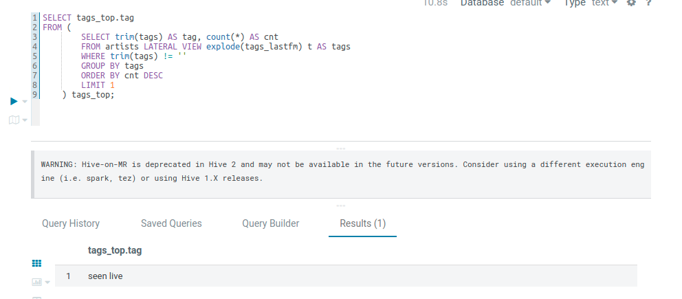

# Homework 2

## Блок 1. Развертывание локального Hive

1) [20 баллов] Развернуть локальный Hive в любой конфигурации 

To deploy Hadoop-Hive cluster, run:
```
  docker-compose up
```

Запущеный Hive: 


2) [15 - 30 баллов] Подключиться к развернутому Hive с помощью любого инструмента: Hue, Python
Driver, Zeppelin, любая IDE итд 

Запуск Hue и Zeppelin в [docker-compose.yaml](docker-compose.yaml)

3) Сделать скриншоты поднятого Hive и подключений в выбранными вами
инструментах, добавить в репозитори

Запущеный Hue: 


Запущеный Zeppelin (До HDFS он стучится, но там нет доступа. Как его открыть - не разобрался): 


## Блок 2. Работа с Hive

1) [15 баллов] Сделать таблицу artists в Hive и вставить туда значения, используя датасет
https://www.kaggle.com/pieca111/music-artists-popularity - 15 баллов

Импорт данных через Hue упорно не работает, поэтому ручками добавим файл в HDFS
```
docker exec -it homework-2_namenode_1 bash

hdfs dfs -mkdir /data
hdfs dfs -put /mnt/data/artists.csv /data/artists.csv'
```
[Запрос на создание таблицы и добавления данных](queries/import-data.sql)


2) Используя Hive найти (команды и результаты записать в файл и добавить в
репозиторий):

    2.а) [5 баллов] Исполнителя с максимальным числом скробблов. [Запрос](queries/a.sql)
    

    2.b) [10 баллов] Самый популярный тэг на ластфм. [Запрос](queries/b.sql)
    

    2.c) [10 баллов] Самые популярные исполнители 10 самых популярных тегов ластфм. [Запрос](queries/c.sql)
    

    2.d) [10 баллов] Любой другой инсайт на ваше усмотрение. Давайте узнаем какой источник тега
самой популярной группы Германии - это last_mf, mb они он встречается в обоих источниках [Запрос](queries/d.sql)
    
